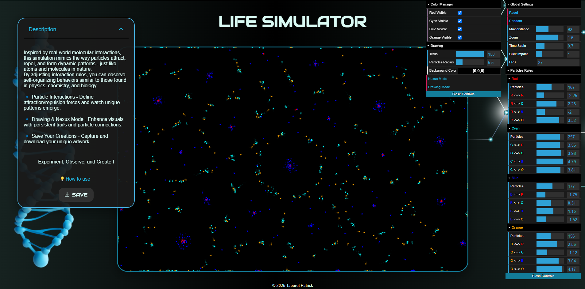
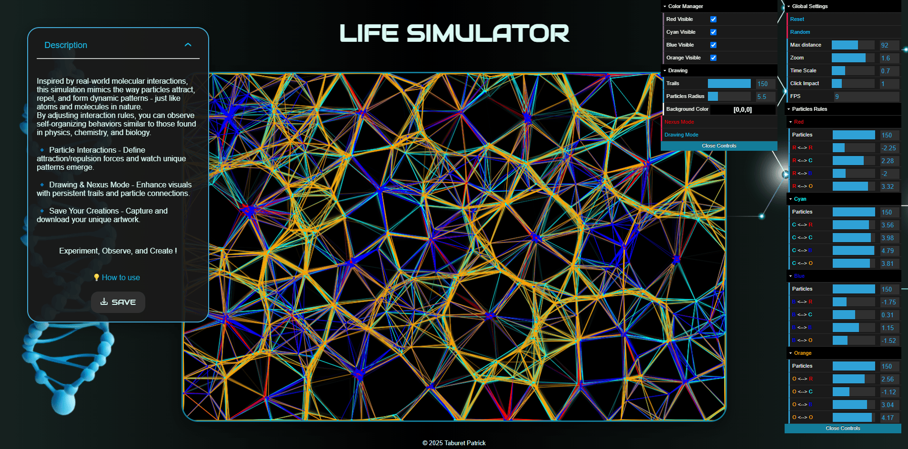
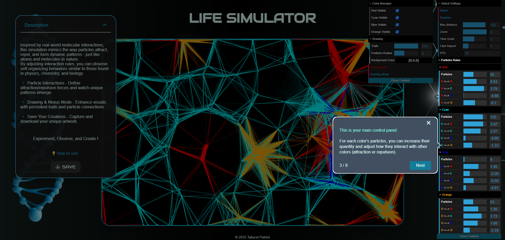

# Life Simulator 🌌  

[Live Demo](https://www.life-simulator.com) | [Portfolio](https://patricktaburet.com)  

## 📖 Description  
**Life Simulator** is an interactive particle-based simulation inspired by molecular interactions in nature. Using customizable rules of attraction and repulsion, particles evolve and self-organize into dynamic patterns, similar to behaviors found in physics, chemistry, and biology.  

Built with **p5.js** for rendering visuals on an HTML canvas, **dat.GUI** for UI control, and **Shepherd.js** for an interactive tutorial, the app blends art and science into a creative playground for exploration.  

Users can adjust interaction rules, switch between different modes (like *Drawing Mode* and *Nexus Mode*), and even save their creations as images.  

---

## 📑 Table of Contents
- [Demo](#-demo)  
- [Features](#-features)  
- [Installation](#-installation)  
- [Technologies](#-technologies)  
- [Project Structure](#-project-structure)  
- [Inspiration](#-inspiration)  
- [License](#-license)  
- [Contact](#-contact)  
- [Screenshots](#-screenshots)  

---

## 🎥 Demo  
Check out the live version here: [Life Simulator](https://www.life-simulator.com)  

---

## ✨ Features  
- **Customizable Particle Interactions:** Adjust attraction and repulsion forces to create unique behaviors and patterns.  
- **Drawing Mode:** Leave persistent trails for artistic visual effects.  
- **Nexus Mode:** Connect particles dynamically to form intricate web-like structures.  
- **Real-Time Interaction:** Modify parameters and observe changes instantly on the canvas.  
- **Save Your Creations:** Capture and download the canvas as an image.  
- **Interactive Tutorial:** Learn how to use the app through a step-by-step guided tour powered by Shepherd.js.  

---

## 💻 Installation  
1. Clone the repository:  
   ```bash
   git clone https://github.com/username/life-simulator.git
   cd life-simulator
   ```
2. Install dependencies (if any):
   ```bash
   npm install
   ```
3. Start a local development server:
   ```bash
   npm start
   ```
Make sure you have a modern browser that supports ES6 modules.

---

## 🛠 Technologies
   - p5.js – for canvas rendering and animation
   - dat.GUI – for creating and managing the UI controls
   - Shepherd.js – for building the interactive tutorial
   - HTML5/CSS3 – for layout and styling
   - ES6 Modules – for better code organization and maintainability

---
  
## 📂 Project Structure
  ```bash
   Copier
   Modifier
   /assets       - Icons and background images  
   /css          - Global stylesheet (minified version for optimization)  
   /js           - JavaScript (ES6 modules)  
     ├── /core 
     │     ├── sketch.js            - Main p5.js sketch handling the canvas rendering and particle behavior  
     │     ├── p5Instance.js        - Singleton to manage a single p5.js instance and make it accessible across modules  
     │     └── appStates.js         - Defines and manages application states (mouse pressed, drawing mode, etc.)  
     ├── /particles  
     │     ├── Particle.js          - Particle class definition  
     │     └── particlesManager.js  - Particle setup, update, and interaction rules  
     ├── /ui   
     │     ├── guiSettings.js       - Initialization of dat.GUI and interaction settings  
     │     ├── shepherd.js          - Configuration of the guided tutorial (Shepherd.js)  
     │     └── setupSaveHandlers.js - Functions for saving canvas images  
     └── /utils  
           └── utils.js             - Utility functions (e.g., calculateCanvasSize, toggleDescriptionCard)
   ```

---

## 🌟 Inspiration
The interaction rules between particles were inspired by the work of hunar4321.
Check out his project here: https://github.com/hunar4321/particle-life.

---

## 📄 License
This project is licensed under the MIT License. You are free to use, modify, and distribute it as you wish.

---

## 📬 Contact
Portfolio: patricktaburet.com
Email: taburet.patrick@gmail.com

---

## 📷 Screenshots  

### Main Interface  
The main interface of the application, showcasing the particle simulation in Drawing Mode with persistent trails.  
  

### Nexus Mode  
In Nexus Mode, particles connect dynamically, creating web-like structures for more complex and visually striking effects.  
  

### Drawing Mode  
In Drawing Mode, users can observe particles leaving colorful trails as they move, generating unique visual patterns reminiscent of abstract art.  
  

### Tutorial Walkthrough with Shepherd.js  
An interactive tutorial guides users through the main features and customization options, making the experience more intuitive.  



